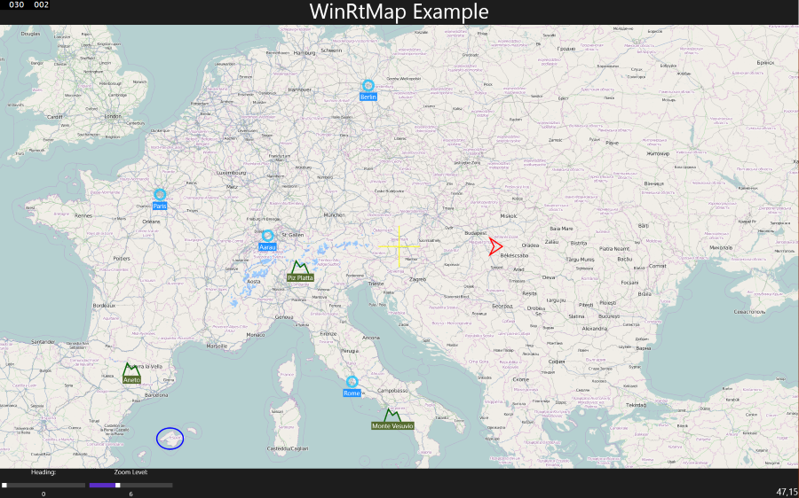

# Universal Map Control
This Repository contains a Map Control for the Universal Windows Platform. It ist build with extensibility in mind and should be easy to adapt to your needs.

Features:
	- Touch input (scale, rotate and Move)
	- Mouse Input (Wheel, Doubleclick etc.)
	- Fast rendering of tiled layers with Win2d
	- Easy placement of other UI elements on the map.
	- Extensible and open source


##Supported Online-Maps
The following Maps are currently supported. Lots of other Maps can easily be added (I am happy to accept pull requests for other map types!). 

- OpenStreetMaps (http://www.openstreetmap.org/)
- Google Maps (Check License!)
- Custom

##Usage
For Eaxmples see the included Demos for Windows 8.1 and Windows Phone ([Demo XAML](../master/UniversalMapControl.Demo/MainPage.xaml)).

```XAML
<umc:Map Name="map" Grid.Row="1" Grid.Column="0" Heading="0" ZoomLevel="4.5" MapCenter="{Binding MapCenter}" PointerMoved="MapOnPointerMoved">
	<interactivity:Interaction.Behaviors>
		<behaviors:TouchMapBehavior />
		<behaviors:AnimatedValuesBehavior x:Name="animatedBehavior" />
	</interactivity:Interaction.Behaviors>

	<tiles:WebTileLayer />
	<!-- Google Maps Layers: Please make sure that you have the required Licenses before activating GoogleMaps!
	<tiles:WebTileLayer LayerName="GooglMapsSatellite" UrlPattern="http://mt{RND-1;2;3}.google.com/vt/lyrs=y&amp;x={x}&amp;y={y}&amp;z={z}" />
	<tiles:WebTileLayer LayerName="GoogleMaps" UrlPattern="http://mt{RND-1;2;3}.google.com/vt/lyrs=m&amp;x={x}&amp;y={y}&amp;z={z}" />
	-->
			
	<!-- ItemsControl bound directly to the Model -->
	<ItemsControl ItemsSource="{Binding Peaks}">
		<ItemsControl.ItemsPanel>
			<ItemsPanelTemplate>
				<umc:MapItemsPanel />
			</ItemsPanelTemplate>
		</ItemsControl.ItemsPanel>
		<ItemsControl.ItemContainerStyle>
			<Style TargetType="ContentPresenter">
				<Setter Property="VerticalAlignment" Value="Center" />
				<Setter Property="HorizontalAlignment" Value="Center" />
				<!-- Binding Helper to allow Binding to the Attached Property 'Location' of the Map -->
				<Setter Property="utils:XamlHelper.LocationBinding" Value="PeakLocation" />
			</Style>
		</ItemsControl.ItemContainerStyle>
		<ItemsControl.ItemTemplate>
			<DataTemplate>
				<Grid>
					<Path Stroke="DarkGreen" StrokeThickness="3" umc:MapLayerBase.Location="{Binding MovingTarget}" Margin="20,80,0,0" HorizontalAlignment="Center">
						<Path.Data>
							<!-- SNIP: Path Data -->
						</Path.Data>
					</Path>
					<Border Background="DarkOliveGreen" Margin="20,80,0,0" Padding="2,2,2,0">
						<TextBlock Text="{Binding PeakName}" HorizontalAlignment="Center" VerticalAlignment="Center" FontSize="15" />
					</Border>
				</Grid>
			</DataTemplate>
		</ItemsControl.ItemTemplate>
	</ItemsControl>
</umc:Map>
```

